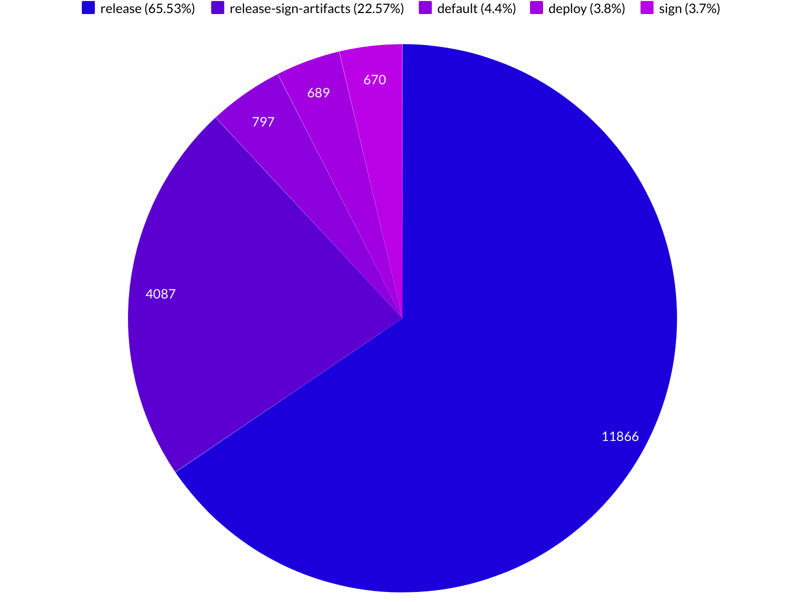

## Intro

I analyzed **229 267** `pom.xml` files.

POM files are from last version of each maven project in repository (`https://repo1.maven.org/maven2/`).

## POM elements

List of used elements in `pom.xml` file. 
The most used element is `<dependencies>`, that is listed in 83.33% of all poms. 

## Dependencies

Element | Used in | Average list size | Max list size 
--- | --- | --- | ---
`<dependencies>` | 83.33% | 6.55 | 421 ([link](https://repo1.maven.org/maven2/org/wildfly/wildfly-ee-galleon-pack/20.0.1.Final/wildfly-ee-galleon-pack-20.0.1.Final.pom))

#### Grouped by GroupId

#### Grouped by ArtifactId

## Licence

Element | Used in | Average list size | Max list size 
--- | --- | --- | ---
`<licenses>` | 60.09% | 1.01 | 29 ([link](https://repo1.maven.org/maven2/com/dorkbox/Network-Dorkbox-Util/1.20/Network-Dorkbox-Util-1.20.pom))

*Legend:*

| short name | full name |
|---|---|
| apache | the apache software license, version 2.0 |
| mit | mit license |
| bsd | bsd-style |
| gnu | gnu lesser general public license |
| lgpl | lgpl 2.1, lgpl 3.0 |
| eclipse | the eclipse public license version 1.0 |
| gpl | gpl v2+, gpl 3.0 |
| agpl | agpl 3.0 |
| mozilla | mozilla public license, version 2.0 |
| isc | isc license |
| affero | affero gplv3 |

## SCM

Element | Used in 
--- | ---
`<scm>` | 58.89%

## People

#### Developers

Element | Used in | Average list size | Max list size 
--- | --- | --- | ---
`<developers>` | 57.94% | 1.65 | 127 ([link](https://repo1.maven.org/maven2/com/cemerick/clojurescript/1.9.922/clojurescript-1.9.922.pom))

**80.55%** `pom.xml` files are with one developer.

#### Contributors

Element | Used in | Average list size | Max list size 
--- | --- | --- | ---
`<contributor>` | 0.93% | 8.39 | 938 ([link](https://repo1.maven.org/maven2/org/citationstyles/styles/2.0.0/styles-2.0.0.pom))

**31.78%** poms with one contributor.

#### Emails

**28751** unique email addresses

## Plugins

#### Build plugins

Element | Used in | Average list size | Max list size 
--- | --- | --- | ---
`<plugins>` | 34.00% | 3.26 | 29 ([link](https://repo1.maven.org/maven2/de/shadowhunt/subversion/4.0.0/subversion-4.0.0.pom))

#### Reporting plugins

Element | Used in | Average list size | Max list size 
--- | --- | --- | ---
`<reportingPlugins>` | 2.17% | 3.00 | 17 ([link](https://repo1.maven.org/maven2/com/dattack/parent/2/parent-2.pom))

## Profiles

Element | Used in | Average list size | Max list size 
--- | --- | --- | ---
`<profiles>` | 13.14% | 1.64 | 55 ([link](https://repo1.maven.org/maven2/cn/home1/maven-build/3.3.0/maven-build-3.3.0.pom))

## Inception years

Element | Used in 
--- | ---
`<inceptionYear>` | 10.81%

## Issue management

Element | Used in 
--- | ---
`<issueManagement>` | 7.41%

## CI Management

Element | Used in 
--- | ---
`<ciManagement>` | 1.54%

