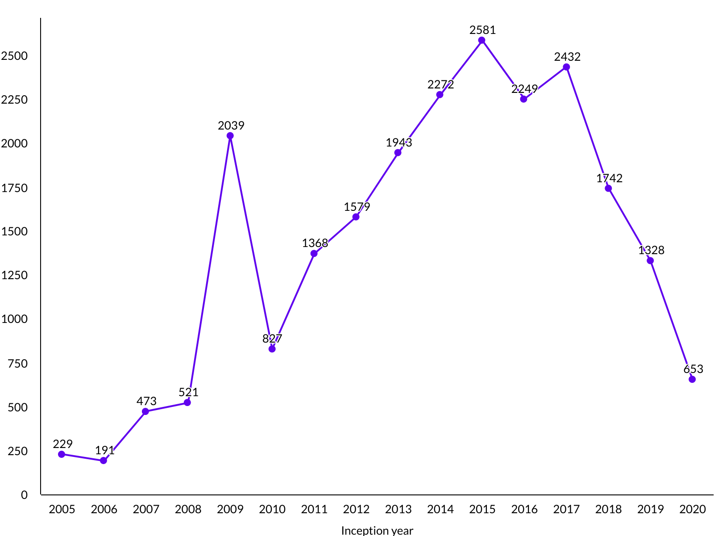

## CI Management

`<ciManagement>` tag was used in **1,54%** of all pom files.

## Developers

`<developers>` tag was used in **57.94%** of all pom files.

**46.67%** `pom.xml` files with one developer TODO: of all poms -> it should be relative to tagged

Average number of developers is **1.65**.

Maximum number of developers is **127** ([link](https://repo1.maven.org/maven2/com/cemerick/clojurescript/1.9.922/clojurescript-1.9.922.pom)).

## Contributors

`<contributor>` tag was used in **0.93%** of all pom files.

**677** poms with one contributor.

Average number of contributors is **8.39**.

Maximum number of contributors is **938** ([link](https://repo1.maven.org/maven2/org/citationstyles/styles/2.0.0/styles-2.0.0.pom)).

## People

**28751** unique email addresses

## Dependencies

`<dependencies>` tag was used in **83.33%** of all pom files.

Average number of contributors is **6.55**.

Maximum number of contributors is **421** ([link](https://repo1.maven.org/maven2/org/wildfly/wildfly-ee-galleon-pack/20.0.1.Final/wildfly-ee-galleon-pack-20.0.1.Final.pom)).

#### Grouped by GroupId

#### Grouped by ArtifactId

## Inception years

`<inceptionYear>` tag was used in **TODO%** of all pom files.

# Issue management

`<inceptionYear>` tag was used in **TODO%** of all pom files.

# Licence

`<license>` tag was used in **60.09%** of all pom files.

Average number of contributors is **1.01**.

Maximum number of contributors is **29** ([link](https://repo1.maven.org/maven2/com/dorkbox/Network-Dorkbox-Util/1.20/Network-Dorkbox-Util-1.20.pom)).

*Note:*

| shortname | license |
|---|---|
| apache | the apache software license, version 2.0 |
| mit | mit license |
| bsd | bsd-style |
| gnu | gnu lesser general public license |
| lgpl | lgpl 2.1, lgpl 3.0 |
| eclipse | the eclipse public license version 1.0 |
| gpl | gpl v2+, gpl 3.0 |
| agpl | agpl 3.0 |
| mozilla | mozilla public license, version 2.0 |
| isc | isc license |
| affero | affero gplv3 |

# Plugins TODO: wierd numbers

`<plugins>` tag was used in **92.03%** of all pom files.

Average number of contributors is **3.26**.

Maximum number of contributors is **29** ([link](https://repo1.maven.org/maven2/de/shadowhunt/subversion/4.0.0/subversion-4.0.0.pom)).

# Reporting plugins TODO: wierd numbers

`<reportingPlugins>` tag was used in **96.87%** of all pom files.

Average number of contributors is **3.00**.

Maximum number of contributors is **17** ([link](https://repo1.maven.org/maven2/com/dattack/parent/2/parent-2.pom)).

# Profiles

`<profiles>` tag was used in **13.14%** of all pom files.

Average number of contributors is **1.64**.

Maximum number of contributors is **55** ([link](https://repo1.maven.org/maven2/cn/home1/maven-build/3.3.0/maven-build-3.3.0.pom)).

# SCM

51112 github repos

